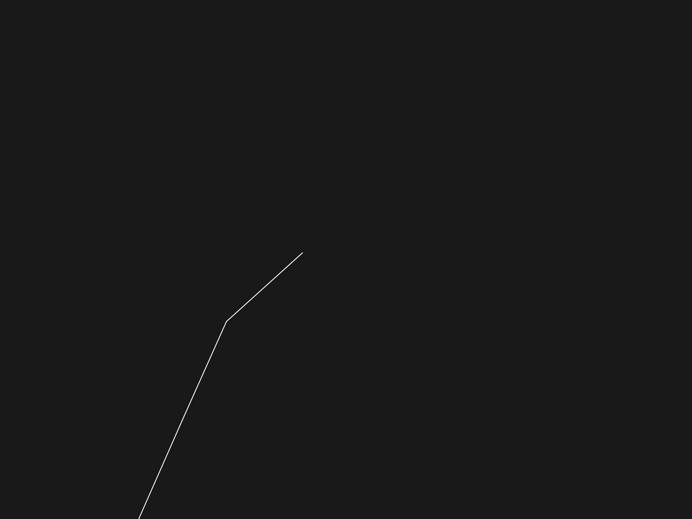

# L_System
This is an old learning project done in Processing. Uploaded from an archive (files have been reformatted or rewritten).

### Simple L_System tree
https://en.wikipedia.org/wiki/L-system (example 7)
- variables : X F
- constants : + − [ ]
- start  : -X
- rules  : (X → F+[[X]-X]-F[-FX]+X), (F → FF)
- angle  : 25°

